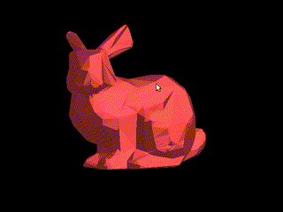
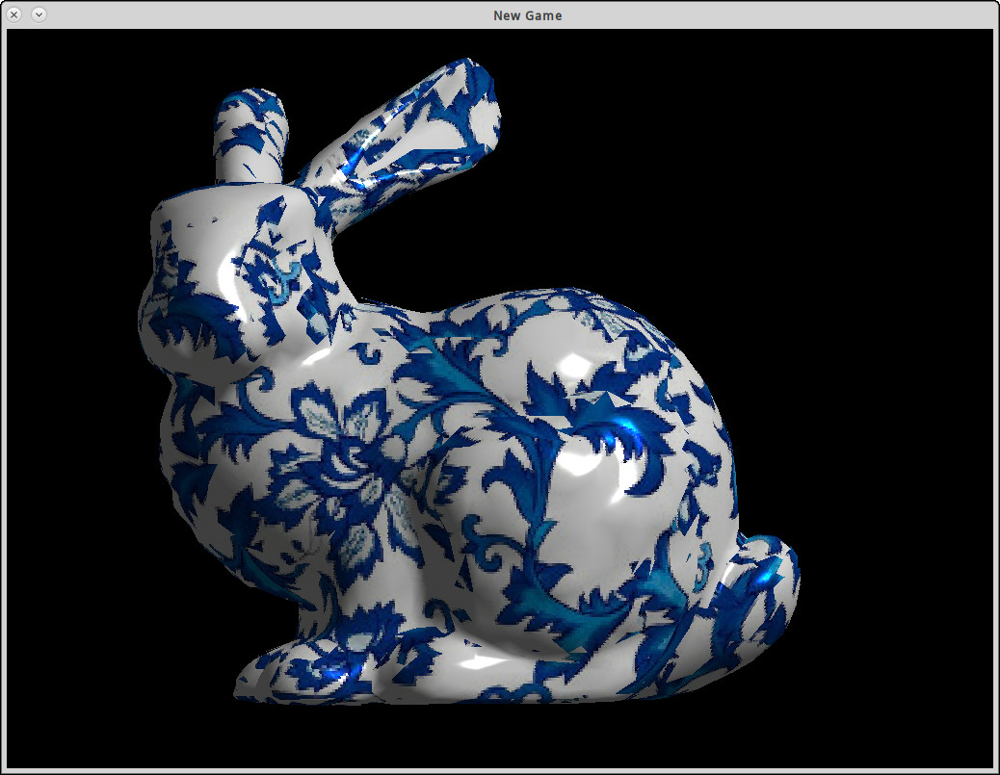

naive-software-renderer
=======================

Stay simple, stay naive. (Made with lisp)

Require:

* [SBCL](http://www.sbcl.org/), [QuickLisp](https://www.quicklisp.org/beta/)
* cmake, make, gcc
* [SDL2](https://www.libsdl.org/)

How to:

* `cd` into source code directory
* Rotating flat shaded bunny: `$ sbcl --load example.lisp`
* Phong shading bunny: `$ sbcl --load example_phong.lisp`

A binary library is used for working with SDL and loading images. If you want to rebuild the C library:

* Make sure you have the devel package of SDL2 (may provided by your Linux distro).
* `cd` into `cutils` directory, `$ cmake CMakeLists.txt`, `make`
